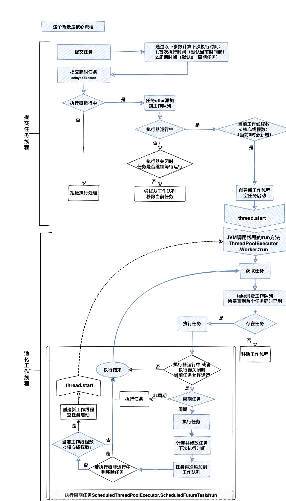

# 介绍

`ScheduledThreadPoolExecutor`是用于延时和周期任务的线程池执行器。继承了`ThreadPoolExecutor`，但是做了如下限制或修改：

在执行器构造参数方面：

1. 仅允许开发者设置`corePoolSize`、`ThreadFactory`、`RejectedExecutionHandler`。
2. 虽然参数固定值`maximumPoolSize=Integer.MAX_VALUE`，但是实际工作线程最大只能到`corePoolSize`数量。
3. 由于`keepAliveTime=0`导致不能开启核心线程超时移除，一旦创建就不会被移除。
4. 采用专门的工作队列`DelayedWorkQueue`，作用是等到任务延迟时间到达后才能被取出。

在提交任务方面：

1. 新增了提交**可延时、周期任务**的`scheduleAtFixedRate`和`scheduleWithFixedDelay`方法。两者都是当前任务执行完后计算下一次执行时间，前者按照上次执行开始时间加上延迟时间，后者是按照当前时间加上延迟时间。仅支持`Runnable`。
2. 新增了`schedule`提交**可延时、非周期**任务，支持`Runnable`和`Callable`
3. 重写了`execute`和`submit`方法，兼容成**不延时、非周期**任务（仅立刻执行一次）。

> 计算任务下次执行时间源码见：juc.ScheduledThreadPoolExecutor.ScheduledFutureTask#setNextRunTime
> period数值解释：正值表示`scheduleAtFixedRate`，负值表示`scheduleWithFixedDelay`，0表示非周期任务（执行一次）。

延时工作队列`DelayedWorkQueue`特性：

1. 通过堆结构（用数组实现二叉树，最小堆）维护任务，适合优先级排序。
2. 堆数组超过容量后扩容，每次增加当前的一半容量。
3. 任务对象`ScheduledFutureTask`时维护数组下标，便于重新排序。移除任务后其下标更新成`-1`。
4. 通过`leader`线程定时等待头部任务剩余时间`available.awaitNanos(delay)`，其他线程堵塞等待`available.await()`直至被唤醒，最小化不必要的线程定时等待。
5. 执行时间不是精准的，完全由工作线程决定。
6. 通过`offer`添加任务：
	1. 插入时，自下而上堆排`siftUp`（最上是最小的）；
	2. 如果添加的是第一个任务，唤醒等待锁的线程`available.signal()`；
7. 通过`take`堵塞获得任务：
	1. 竞争锁（线程中断异常）。
	2. 第一个任务空则线程等待`available.await()`，可由上文`signal`唤醒。
	3. 第一个任务存在且已到执行时间，则移除任务，自上而下堆排`siftDown`，设置移除下标`-1`，返回任务。
	4. 第一个任务存在且未到执行时间，将任务引用对象置空（线程堵塞时不要保留引用）；非`leader`线程阻塞等待，`leader`线程指定任务剩余执行时间等待，等待结束唤醒所有等待线程。
8. 通过`remove`移除任务:
	1. 获取数组坐标，任务对象`ScheduledFutureTask`时快速获取（O(log n)），其他类型则遍历数组（O(n)不建议自定义任务类型）。
	2. 自上而下堆排`siftDown`，如移除是最后一个则再自下而上堆排`siftUp`。

> [DelayedWorkQueue及堆排详细解释见:https://blog.csdn.net/nobody_1/article/details/99684009](https://blog.csdn.net/nobody_1/article/details/99684009)

任务取消方面：

任务提交后未执行前取消，默认是不会将任务移除出队列，直到任务执行时才会校验任务状态。 为避免这种情况，设置`setRemoveOnCancelPolicy(true)` ，可以在取消时立即从工作队列中删除。

# 执行流程图

[drawio下载]({{ site.baseurl }}/assets/drawio/线程池.drawio)

{:.border.rounded}

{:.border.rounded}