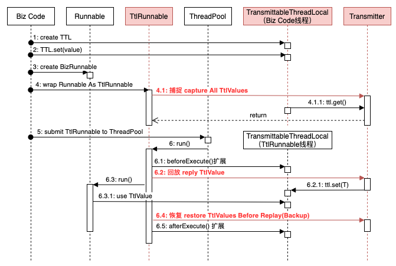

> 在做链路日志框架优化，需要将业务线程与其关联池化线程的链路打通（traceId传递），用到该项目，做个小笔记。

本篇主要介绍`alibaba/transmittable-thread-local`（下文统称`TTL`）项目，该项目实现线程间的值传递，甚至能传递到线程池创建的线程中。

该项目优秀文章聚合页地址 https://github.com/alibaba/transmittable-thread-local/issues/123

---

先复习下`JDK`自带的本地线程。

`ThreadLocal`常用于线程内的变量值存储和传递。

`InheritableThreadLocal`可继承的本地线程，增加了父线程的变量值传递给子线程的能力。


快速理解`ThreadLocal`原理：

```
ThreadLocal<Object> threadLocal = new ThreadLocal<>();
Object value = new Object();
threadLocal.set(value);
Object valueReturn = threadLocal.get();
Assert.assertEquals(value,valueReturn);
```

值存储

```
# ThreadLocal.set(T)
public void set(T value) {
	// 获取调用该方法的线程
  Thread t = Thread.currentThread();
  // 获取当前线程的ThreadLocalMap属性
  // ThreadLocalMap内部是<K,V>存储，
  // K是ThreadLocal，V是存储值
  ThreadLocalMap map = getMap(t);
  // 存储<当前ThreadLocal，value>
  if (map != null)
  	map.set(this, value);
  else
  	createMap(t, value);
}
```

值传递

```
# ThreadLocal.get()
public T get() {
	// 获取调用该方法的线程
  Thread t = Thread.currentThread();
  // 获取当前线程的ThreadLocalMap属性
  ThreadLocalMap map = getMap(t);
  if (map != null) {
  	// 通过K=当前ThreadLocal获取value存储值
  	ThreadLocalMap.Entry e = map.getEntry(this);
    if (e != null) {
      T result = (T)e.value;
      return result;
    }
  }
  return setInitialValue();
}
```

小结：

- `Thread`线程对象属性`threadLocals`维护`ThreadLocalMap<ThreadLocal,value>`
- 一个线程可以存储多个`ThreadLocal`及其变量值
- 对`ThreadLocal`访问（`set`、`get`）都是和当前访问线程关联，所以做到线程隔离

> `ThreadLocalMap`不是直接继承`Map`，内部实现了一套基于数组的存储和查询。但当本地线程较多时会产生扩容重排操作。
>
> 另外`Netty`中的`FastThreadLocal`使用不同的存储和查询机制（唯一索引），相对`JDK`的`ThreadLocal`提升了吞吐，但占用更多空间。详见http://www.cnblogs.com/stevenczp/p/7667719.html


快速理解`InheritableThreadLocal`原理：

```
InheritableThreadLocal<Object> inheritableThreadLocal 
	= new InheritableThreadLocal<>();
Object value = new Object();
inheritableThreadLocal.set(value);
new Thread(() -> {
	// 子线程
	Object valueReturn = inheritableThreadLocal.get();
	Assert.assertEquals(value,valueReturn);
}).start();
```

其继承`ThreadLocal`，通过重写关键方法，将本地线程及变量值保存到了`Thread`的另一个属性`inheritableThreadLocals`。

1. 父线程存储变量到`inheritableThreadLocals`

```
// 基本逻辑同前面的ThreadLocal.set(T)
// 但是getMap(t)方法被重写
ThreadLocalMap getMap(Thread t) {
	// 此处t是父线程
	// 返回的是Thread的inheritableThreadLocals属性
	// 而不是原来的threadLocals属性
	return t.inheritableThreadLocals;
}
```

2. 父线程创建子线程处理

```
# new Thread()
## Thread.init(...)
// 注意，当前还是在父线程
Thread parent = currentThread();
// inheritThreadLocals默认true，表示允许继承本地变量
// parent.inheritableThreadLocals 就是上一步存储用的属性
if (inheritThreadLocals && parent.inheritableThreadLocals != null)
	 // 就是这里，父线程将自己的本地线程信息传递给了子线程
	 // 依然是存在inheritableThreadLocals属性，表示可以继续往孙子线程传递
   this.inheritableThreadLocals =
       ThreadLocal.createInheritedMap(parent.inheritableThreadLocals);
```

3. 子线程获取该继承的本地线程变量

```
// 基本逻辑同前面的ThreadLocal.get()
// 但是getMap(t)方法被重写
ThreadLocalMap getMap(Thread t) {
	// 此处是t是子线程
	// 获取的inheritableThreadLocals属性值就是上一步父线程传递的
	return t.inheritableThreadLocals;
}

```


---

以上`JDK`提供的可继承本地线程，只能是父子关系线程的传递，而对于池化线程（线程由线程池创建维护），不能起到值传递作用。而`TTL`就是专门解决这种场景的。

对于介绍和使用，请查看https://github.com/alibaba/transmittable-thread-local#readme。下文主要介绍其设计思想及代码原理。

官方的核心设计思想：捕捉capture、回放replay和恢复restore。

1. 捕捉：将当前主线程的`可继承ThreadLocal`信息维护起来；

2. 回放：将池化线程的本地线程信息保存备份并移除，将上一步捕捉的信息设置到池化线程；

3. 恢复：池化线程执行结束后，移除捕捉的信息，恢复备份信息。


如下根据官方提供的时序图修改的：

[下载drawio]({{ site.baseurl }}/assets/drawio/TTL.drawio)

{:.border.rounded}

{:.border.rounded}

写个小demo：

```
Object value = new Object();
// 使用TTL
TransmittableThreadLocal<Object> ttl
	= new TransmittableThreadLocal<>();
// 主线程设置传递值
ttl.set(value);
ExecutorService executorService = Executors.newFixedThreadPool(10);
// 线程池增强
Executor ttlExecutor = TtlExecutors.getTtlExecutor(executorService);
ttlExecutor.execute(() -> {
	// 池化线程获取传递值
	Object valueReturn = transmittableThreadLocal.get();
	Assert.assertEquals(value,valueReturn);
});
```

结合如上代码，看下`TTL`是怎么实现设计思想的。

先说下`TransmittableThreadLocal`继承`InheritableThreadLocal`，所以默认就支持父子线程的值传递。

1. 主线程设置传递值

```
# TransmittableThreadLocal.set(T)
// 同InheritableThreadLocal.set(T)
super.set(value);
// TransmittableThreadLocal.holder是静态变量
// 获取当前主线程的`TransmittableThreadLocal`
// 并保存到该holder中
this.addThisToHolder();
```

> 这个`holder`虽然是静态变量，但是由于使用`InheritableThreadLocal`对象，当执行`holder.get()`时获取的还是当前线程的所有`TransmittableThreadLocal`信息。方便后续**捕捉**获取当前线程的所有`ThreadLocal`对象。
>
> 另外这种方式也很好支持了池化线程之间的值传递（套娃）。

2. 线程池增强

```
# TtlExecutors.getTtlExecutor(executorService);
## new ExecutorTtlWrapper(executor, true)
// 用了装饰者模式，用TTL的线程池对象包装JDK的线程池对象，添加额外的职责，啥职责呢？！
```

3. 提交任务，池化线程执行

```
# ttlExecutor.execute(Runnable)
## TtlRunnable.get(Runnable,x,x)
### new TtlRunnable(runnable, x);
// 这个`TtlRunnable.get`就是额外的职责，他将Runnable转成TtlRunnable
```

**捕捉**就是在`new TtlRunnable`中完成的，其属性`capturedRef`在实例化如下：

```
AtomicReference<Object> capturedRef 
	= new AtomicReference(Transmitter.capture());
```

```
# Transmitter.capture()
## new ttl.xxx.Snapshot(captureTtlValues(), captureThreadLocalValues());
```

注意当前还是在主线程。

`capturedRef`属性负责临时存放所有捕捉信息，

`captureTtlValues()`，通过`TransmittableThreadLocal.hold.get()`获取到当前线程的所有`TransmittableThreadLocal`信息并保存。

> 强调下，这个捕捉默认是引用拷贝，当引用对象属性发生变化，会影响快照里的值。

4. 任务运行（下面都是在池化线程中）

```
# TtlRunnable.run()
// 获取捕捉信息
## Object captured = this.capturedRef.get();
// 回放
## Object backup = Transmitter.replay(captured);
// 执行业务逻辑
## this.runnable.run();
// 恢复
## 【finally】Transmitter.restore(backup);
```

**回放**

```
# Transmitter.replay(captured);
## ttl.xxx.Snapshot(replayTtlValues(capturedSnapshot.ttl2Value)
, replayThreadLocalValues(capturedSnapshot.threadLocal2Value));
```

```
# replayTtlValues
// 获取池化线程自己的inheritThreadLocals并返回备份
TransmittableThreadLocal.holder.get()
backup.put(threadLocal, threadLocal.get());
// 将捕捉信息设置到池化线程中
setTtlValuesTo(captured);
threadLocal.set(T)
```

特别要说明`threadLocal.set(T)`，因为是在池化线程上操作`TransmittableThreadLocal.set`，是对池化线程的`TransmittableThreadLocal`设置值，而不是来源线程。

业务`Runnable`执行过程中，通过`threadLocal.get()`方法获取时，就会获取到该`TransmittableThreadLocal`传递的值了。

**恢复**

业务`Runnable`执行结束后，清除**回放**设置的值，将**备份**数据设置回去。

```
# Transmitter.restore(backup);
// 遍历当前池化线程的TransmittableThreadLocal.holder所有ThreadLocal信息，逐个遍历
// 	移除TransmittableThreadLocal.holder中当前ThreadLocal信息
// 	移除Thread.inheritableThreadLocals中当前ThreadLocal信息
restoreTtlValues(backup.ttl2Value);
// 将备份设置回TransmittableThreadLocal.holder和Thread.inheritableThreadLocals
setTtlValuesTo(backup);
```


上文以`修饰线程池`方式介绍，还可以通过修饰`Runnable`和`Callable`方式，以及使用`Java Agent`来修饰`JDK`线程池实现类方式。`修饰线程池`方式实质就是自动修饰`Runnable`和`Callable`。`Java Agent`方式对应用代码无侵入，但是要修改启动命令。

其支持的`JDK`组件有`java.util.concurrent.ThreadPoolExecutor` 、 `java.util.concurrent.ScheduledThreadPoolExecutor`、`java.util.concurrent.ForkJoinTask`等。

> **官方介绍**：`Java 8`引入的`CompletableFuture`与（并行执行的）`Stream`底层是通过`ForkJoinPool`来执行，所以支持`ForkJoinPool`后，`TTL`也就透明支持了`CompletableFuture`与`Stream`。

这个项目还有很多宝藏待挖掘🎉

希望各位给`alibaba/transmittable-thread-local`点个🌟

