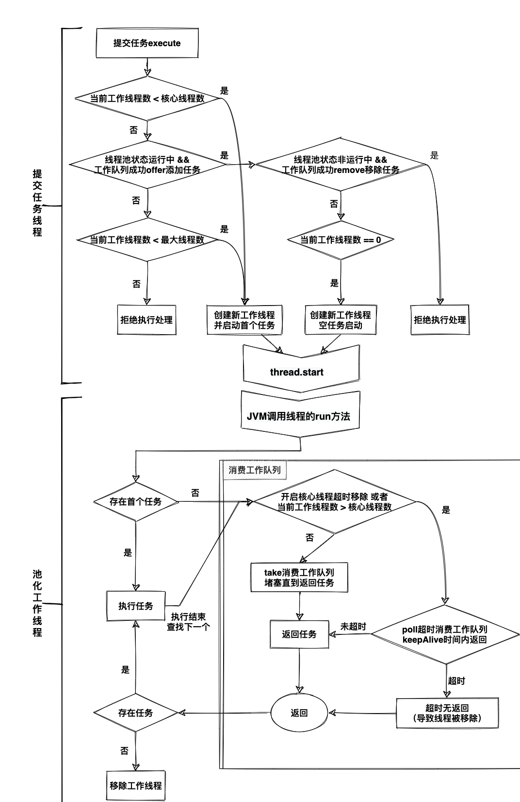

# 介绍

线程池是`JUC`的重要组成，也是中间件常用执行器。
本章小结`ThreadPoolExecutor`注释信息。

先理简单介绍下参数：

- corePoolSize – 核心池大小。
- maximumPoolSize – 最大池大小。
- keepAliveTime – 保活时间，空闲线程在终止前等待新任务的最长时间。
- unit – keepAliveTime参数的时间单位。
- workQueue – 工作队列，用于缓存未能执行的任务队列。 
- threadFactory – 创建新线程时使用的工厂。
- handler –  被拒绝的任务处理器

---

线程池解决了两个主要问题：

- 限制和管理线程资源，执行大量异步任务时，减少任务调用开销；
- 统计任务信息，例如已完成任务数。

官方强烈建议程序员使用`Executors`工厂方法处理常见场景:

- Executors.newCachedThreadPool （无界线程池，具有自动线程回收）

-  Executors.newFixedThreadPool （固定大小线程池）

- Executors.newSingleThreadExecutor （单个后台线程）

以上不满足时，可以手动配置参数：

- 核心池大小和最大池大小
    `ThreadPoolExecutor`将根据属性`corePoolSize`核心池大小和`maximumPoolSize`最大池大小来自动调整池大小。可以在构造器中设置，也可以调用setter方法动态设置。
    
    当在调用方法`execute(Runnable)`提交新任务，存在三种情况：
    
    - 正在运行的线程数少于`corePoolSize`时，即使其他工作线程空闲，也会创建一个新线程来处理请求。 
    - 正在运行的线程数超过`corePoolSize`但小于`maximumPoolSize`，则只有在队列已满时才会创建新线程。 
    - 队列已满时，尝试添加新线程失败，则表示已经饱和或关闭，执行失败策略。
    
    不同池大小配置形成的经典线程池：
    
    - 通过将`corePoolSize`和`maximumPoolSize`设置相同大小，创建固定大小线程池。
    - 通过将`maximumPoolSize`设置为基本上无界的值，例如`Integer.MAX_VALUE`，创建无界线程池。

- 按需构建线程
    默认情况下，核心线程只有在新任务到达时才首次创建和启动，但可以调用方法`prestartCoreThread`或`prestartAllCoreThreads`提前创建单个或所有核心线程。推荐用于非空队列的线程池。
    
- 创建新线程
    使用`ThreadFactory`创建新线程。默认使用`Executors.defaultThreadFactory`，它创建的线程都在同一个`ThreadGroup`并且具有相同的`NORM_PRIORITY`优先级和非守护进程状态。通过设置不同的`ThreadFactory`，可以更改线程的名称、线程组、优先级、守护进程状态等。
    
- 线程保活时间
    如果当前工作线程数超过`corePoolSize`，多余的工作线程如果空闲时间超过`keepAliveTime`将被终止，减少资源消耗。可以使用`setKeepAliveTime(long, TimeUnit)`方法动态更改此参数。通过设置参数为`Long.MAX_VALUE,TimeUnit.NANOSECONDS`可以防止空闲线程被终止。
    
    默认情况下，`corePoolSize`内的线程不会被终止，但调用方法`allowCoreThreadTimeOut(true)`时，保活时间也用于核心线程。
    
- 工作队列
    工作队列可用于传输和保存提交的任务。该队列的使用与池大小交互：
    
    - 如果运行的线程数少于`corePoolSize`，则`Executor`优先添加新线程而不是加入队列。
    
    - 如果超过`corePoolSize`线程正在运行，`Executor`优先将请求加入队列而不是添加新线程。
	
    - 如果请求无法加入队列，则会创建一个新线程。如果线程数超过`maximumPoolSize`，任务将被拒绝。
    
    
    常用工作队列有以下三种：
   
   - 直接交接。工作队列的一个很好的默认选择是SynchronousQueue，它将任务移交给线程而不用其他方式保留它们。如果没有线程可立即运行，则将任务尝试加入排队返回失败，构建新线程。比较适合处理具有内部依赖的请求集，此策略可避免堵塞。直接切换通常需要无限的`maximumPoolSizes`以避免拒绝新提交的任务。当请求提交速度快于处理速度时，导致池大小无限增加。
   - 无界队列。 使用无界队列（例如没有设置容量的`LinkedBlockingQueue`），将引起新任务在所有`corePoolSize`线程都繁忙时在队列中等待。 因此不会创建超过`corePoolSize`的线程（`maximumPoolSize`无意义）。比较适合每个任务完全独立场景。当请求提交速度快于处理速度时，导致工作队列无限增长。
   - 有界队列。 有界队列（例如`ArrayBlockingQueue` ）在与有限的`maximumPoolSizes`一起使用时有助于防止资源耗尽，但可能更难以调整和控制。队列大小和最大池大小可以相互权衡：
     - 使用大队列和小池可以最大限度地减少CPU使用率、操作系统资源和上下文切换开销，但导致人为地降低吞吐量。如果任务频繁阻塞，导致任务超时。 
     - 使用小队列通常需要更大的池大小，这会使CPU更忙，可能会遇到不可接受的调度开销，这也会降低吞吐量。
   
- 被拒绝的任务处理
    当`Executor`已经关闭，或者达到最大池大小和有界的工作队列饱和时，方法`execute(Runnable)`提交的新任务将被拒绝。默认提供了四个拒绝处理策略：
    
    - `ThreadPoolExecutor.AbortPolicy` ，默认策略，直接抛异常`RejectedExecutionException `。
    
    - `ThreadPoolExecutor.CallerRunsPolicy `，如果执行器没有关闭，调用`execute`自身线程直接运行任务。
    
    - `ThreadPoolExecutor.DiscardPolicy` ，直接丢弃。
    
    - `ThreadPoolExecutor.DiscardOldestPolicy` ，如果执行器没有关闭，丢弃工作队列的头部任务，然后重试提交（直到成功）。
    
   自定义拒绝策略实现`RejectedExecutionHandler`接口。
   
- 钩子方法
    子类可重写方法`beforeExecute(Thread, Runnable)`和`afterExecute(Runnable, Throwable)`，实现自定义的每个任务执行前后处理。可用于操作执行环境，例如，重新初始化`ThreadLocals`、收集统计信息或添加日志条目。
    
    子类可重写`terminated`方法，实现自定义的`Executor`完全终止后处理。
    
    注意：如果钩子方法抛出异常，可能会导致工作线程失败并意外终止。
    
- 队列维护
    方法`getQueue()`允许访问工作队列以进行监视和调试。 强烈建议不要将此方法用于任何其他目的。
    
    方法`remove(Runnable)`和`purge`可用于在大量排队任务被取消时协助存储回收。
    
- Finalization
  
    线程池不再被引用，也没有存活的工作线程后，将会自动`shutdown`。如果想确保即使用户忘记调用`shutdown`也能回收未被引用的池，必须通过设置适当的线程保活时间、使用0核心线程数或设置`allowCoreThreadTimeOut(true)`来保证未使用的线程最终失活。

---

# 执行流程图

综上所述的流程图(执行模版)：

[drawio下载]({{ site.baseurl }}/assets/drawio/线程池.drawio)

{:.border.rounded}

{:.border.rounded}


---

# 提供线程池介绍

`Executors`提供了几种常用`ThreadPoolExecutor`线程池实现：

- 固定线程线程池

  ```
  public static ExecutorService newFixedThreadPool(int nThreads) {
      return new ThreadPoolExecutor
        (nThreads, nThreads,
        0L, TimeUnit.MILLISECONDS,
        new LinkedBlockingQueue<Runnable>());
  }
  ```

  根据系统CPU核数指定池固定大小，有利于提高吞吐同时减少多线程压力。

  默认`allowCoreThreadTimeOut=false`，所以默认情况下，核心线程数量内的工作线程不会被销毁。


- 单线程线程池

  ```
  public static ExecutorService newSingleThreadExecutor() {
    return new FinalizableDelegatedExecutorService
      (new ThreadPoolExecutor(1, 1,
      0L, TimeUnit.MILLISECONDS,
      new LinkedBlockingQueue<Runnable>()));
  }
  ```

  约等同于`newFixedThreadPool(1)`。

  `FinalizableDelegatedExecutorService`父类`DelegatedExecutorService`只暴露执行器的方法，所以线程池参数禁止动态修改。

  `FinalizableDelegatedExecutorService`本身添加了`finalize()`，对象GC前可能会调用`finalize()`方法,来关闭线程池。


- 缓存线程池

  ```
  public static ExecutorService newCachedThreadPool() {
    return new ThreadPoolExecutor
    	(0, Integer.MAX_VALUE,
      60L, TimeUnit.SECONDS,
      new SynchronousQueue<Runnable>());
  }
  ```

  适合短频快的任务。工作线程闲置60秒被销毁。

  `SynchronousQueue`比较特殊，不保存任务，而是提交任务线程堵塞等待工作线程消费任务。具体分析看https://juejin.cn/post/6844904136274608136


结合前面的流程图模版，可以对以上提供的线程池实现进行分析：

| 条件                                                       | 流程                                      | 固定/单线程池     | 缓存线程池            |
| ---------------------------------------------------------- | ----------------------------------------- | ----------------- | --------------------- |
| 工作线程数 小于 核心线程数                                 | 1. 新建工作线程,启动任务;(跳到步骤5)      | ✅                 | /                     |
| 工作线程数 大于等于 核心线程数                             | 2. 任务被offer到工作队列中;               | ✅（队列近乎无界） | ✅                     |
| 工作线程数 等于 0                                          | 2.1 新建工作线程,启动空任务;              | ✅                 | ✅                     |
| 工作队列加入失败，<br />且工作线程数 小于 最大线程数       | 3. 新建工作线程，启动任务；               | /                 | ✅（最大线程近乎无限） |
| 工作线程数 大于等于 最大线程数                             | 4. 拒绝执行处理                           | /                 | /                     |
| 工作线程空任务或执行完成后                                 | 5. 等待工作队列返回任务;                  | -                 | -                     |
| 工作线程数 小于等于 核心线程数                             | 5.1 take堵塞等待工作队列返回任务;         | ✅                 | /                     |
| (工作线程数 大于 核心线程数) <br />或者 (开启核心线程超时) | 5.2 poll超时等待工作队列返回任务;         | ✅0秒超时          | ✅60秒超时             |
|                                                            | 6. 返回任务则运行任务;(执行结束跳到步骤5) | ✅                 | ✅                     |
| 超时达到keepAliveTime                                      | 7. 无返回任务则销毁工作线程;              | ✅                 | ✅                     |


